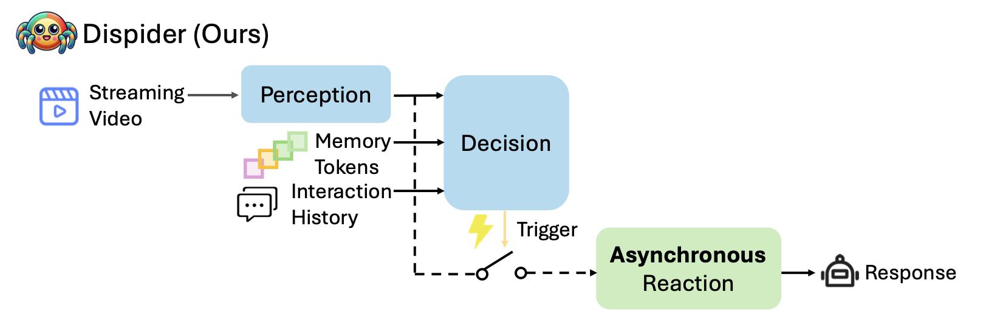

#  Dispider
This repository is the official implementation of Dispider （CVPR 2025）.




<p align="center" style="font-size: em; margin-top: 0.5em">

[](https://creativecommons.org/licenses/by-nc/4.0/)<br>
<a href="http://arxiv.org/abs/2501.03218">"></a>
<a href="assets/paper.pdf"></a>
<a href="https://huggingface.co/Mar2Ding/Dispider"></a>
<!-- <a href="https://mark12ding.github.io/project/SAM2Long/"></a> -->
</p>


>[**Dispider: Enabling Video LLMs with Active Real-Time Interaction via Disentangled Perception, Decision, and Reaction**](http://arxiv.org/abs/2501.03218)<br>
> [Rui Qian](https://shvdiwnkozbw.github.io/), [Shuangrui Ding](https://mark12ding.github.io/), [Xiaoyi Dong](https://lightdxy.github.io/), [Pan Zhang](https://panzhang0212.github.io/)<br>
[Yuhang Zang](https://yuhangzang.github.io/), [Yuhang Cao](https://scholar.google.com/citations?user=sJkqsqkAAAAJ), [Dahua Lin](http://dahua.site/), [Jiaqi Wang](https://myownskyw7.github.io/)<br>
CUHK, Shanghai AI Lab


## 📰 News
- [2025/3/11] 🔥🔥🔥We released the checkpoints of Dispider at [Huggingface🤗](https://huggingface.co/Mar2Ding/Dispider)🤗🤗
- [2025/2/27] 🔥🔥🔥Dispider is accepted at CVPR 2025! Cheers🍻🍻🍻
- [2025/1/6] 🔥🔥🔥 We released the paper on [arXiv](http://arxiv.org/abs/2501.03218)!

## 🧾 ToDo Lists
- [x] Release Inference Code
- [ ] Release Checkpoints
- [ ] Release Training Code
- [ ] Release Demo Video


## 💡 Highlights
### 🔥 A New Paradigm for Online Video LLMs with Active Real-Time Interaction
Dispider enables real-time interactions with streaming videos, unlike traditional offline video LLMs that process the entire video before responding. It provides continuous, timely feedback in live scenarios.

### ⚡️ Disentangled Perception, Decision, and Reaction Modules Operating Asynchronously
Dispider separates perception, decision-making, and reaction into asynchronous modules that operate in parallel. This ensures continuous video processing and response generation without blocking, enabling timely interactions.


### 🤯 Superior Performance on StreamingBench and Conventional Video Benchmarks
Dispider outperforms VideoLLM-online on StreamingBench and surpasses offline Video LLMs on benchmarks like EgoSchema, VideoMME, MLVU, and ETBench. It excels in temporal reasoning and handles diverse video lengths effectively.

## 🛠️ Installation
Follow the steps below to set up the Dispider environment. We recommend using the specified versions of each library to ensure reproduce optimal performance.

### 1. **Create and Activate a Conda Environment**

First, create a new Conda environment with Python 3.10 and activate it:

```bash
conda create -n dispider python=3.10 -y
conda activate dispider
```

### 2. Upgrade pip

Ensure that `pip` is up to date to avoid any installation issues:

```bash
pip install --upgrade pip
```


### 3. Install Required Libraries
Ensure that CUDA 11.8 is installed on your system. You can download it from the [official NVIDIA website](https://developer.nvidia.com/cuda-11-8-0-download-archive). Follow the installation instructions provided there.

```bash
pip install torch==2.2.0 torchvision==0.17.0 torchaudio==2.2.0

pip install flash-attn==2.5.9.post1 transformers==4.41.2 deepspeed==0.9.5 accelerate==0.27.2 pydantic==1.10.13 timm==0.6.13
```

## Quick Start
First download the checkpoints at the folder. 

To perform single-turn inference, execute the following script:
```bash
python inference.py --model_path YOUR_MODEL_PATH --video_path YOUR_VIDEO_PATH --prompt YOUR_PROMPT
```
By default, the prompt is inserted at the beginning of the streaming video. The expected response will be generated in a single turn.

## Example Evaluation of VideoMME
Update the `video_path` in `data/videomme_template.json` and adjust the corresponding argument in `videomme.sh`. Then execute the following command, which will utilize 8 GPUs to run the inference in parallel:
```bash
bash scripts/eval/videomme.sh
```


## ☎️ Contact
Shuangrui Ding: mark12ding@gmail.com


## 🔒 License
The majority of this project is released under the CC-BY-NC 4.0 license as found in the LICENSE file. 


## 👍 Acknowledgements
This codebase is built upon [LLaVA](https://github.com/haotian-liu/LLaVA) and leverages several open-source libraries. We extend our gratitude to the contributors and maintainers of these projects.


## ✒️ Citation
If you find our work helpful for your research, please consider giving a star ⭐ and citation 📝.
```bibtex
@article{qian2025dispider,
        title={Dispider: Enabling Video LLMs with Active Real-Time Interaction via Disentangled Perception, Decision, and Reaction},
        author={Qian, Rui and Ding, Shuangrui and Dong, Xiaoyi and Zhang, Pan and Zang, Yuhang and Cao, Yuhang and Lin, Dahua and Wang, Jiaqi},
        journal={arXiv preprint arXiv:2501.03218},
        year={2025}
      }

@article{qian2025streaming,
  title={Streaming long video understanding with large language models},
  author={Qian, Rui and Dong, Xiaoyi and Zhang, Pan and Zang, Yuhang and Ding, Shuangrui and Lin, Dahua and Wang, Jiaqi},
  journal={Advances in Neural Information Processing Systems},
  volume={37},
  pages={119336--119360},
  year={2025}
}
```


